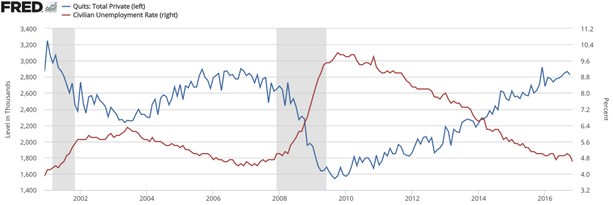

# Employee Attrition {.tabset .tabset-fade}

## Background

  Attrition in very basic concept is type of employee churn. Some probably wonders what the diffrent with another type of churn 'the turnover', both are a decrease number of employees on staff, but attrition is typically voluntary or natural - like retirement or resignation. Acording to [FRED - Economic Research](https://fred.stlouisfed.org/graph/?id=JTS1000QUL,#0), quits rate in private sector have been increasing. This higher rate often means that employees are dissatisfied with their jobs. 



  The problem is, this could lead to relatively high cost to the company, the time or the cost of money from acquiring a new talent. In fact, [the average cost-per-hire to fill a vacant position due to turnover or preventable attrition is $4,129](https://www.shrm.org/hr-today/trends-and-forecasting/research-and-surveys/Documents/2017-Talent-Acquisition-Benchmarking.pdf).  
  
  In this project I try to predict employee attrition with machine learning. I will use a data set provide by [IBM - Watson Analytics Community Sample Data](https://www.ibm.com/communities/analytics/watson-analytics-blog/hr-employee-attrition/). In his data, each variable (row) describes the employee with parameters like: age, department, Job Role, income, years at company, etc. The target variable 'Attrition' is known (it is historical value) and  our main objective is to do machine learning classification (we predict yes/no for attrition).

```{r setup, include=FALSE}
# Set up packages
pacman::p_load(tidyverse, tidyquant, ggplot2, gmodels, class, tm, mlr, partykit, ROCR, cluster, caret, parallel, doParallel, randomForest, prettydoc, kableExtra, corrplot, ISLR, cowplot, VIM)

# fix some crash in namespace
slice <- dplyr::slice
margin <- ggplot2::margin
```  

  The HR_employee_attrition.csv data is containing Employee Attrition and Performance from IBM, take a peek to the data:
  
```{r echo=FALSE, warning=FALSE, message=FALSE}
# import data set
attdat <- read_csv("data_input/HR_employee_attrition.csv")

# building table
kable(attdat[1:5,]) %>%
  kable_styling(bootstrap_options = c("striped", "hover")) %>% 
   scroll_box(width = "100%")
```


In here I will delve into the specific details with far greater depth few of
parameters in the dataset we've just read into our environment:  

* `EmployeeID`: The ID of each individual employee.
* `Attrition`: Yes or No Parameter wether the employee commit attrition.
* `BusinessTravel`: One of factor of `Non-Travel`, `Travel_Frequently` and `Travel_Rarely`
* `Education`: Ranged from 1 `Below College`, 2 `College`, 3 `Bachelor`, 4 `Master` and 5 `Doctor ` 
* `EnvironmentSatisfaction`:Rating from employee range from; 1 `Low`, 2 `Medium`, 3 `High` and 4 `Very High`. This appraisal were included in few parameters such as;`JobInvolvement`,`RelationshipSatisfaction`, `PerformanceRating`, `JobSatisfaction` and `WorkLifeBalance`.


## Preprocessing data

  Before we start anylizing the data we should check if theres mising value that would hinder our process.
```{r}
# detecting missing value
attdat %>% 
  aggr()
```
  
  
  There's no missing value and after we check, there's a few parameters in the data who don't have variance that we could remove it in order to decrease dimension.
  
```{r results='hide'}
# Quick check 
glimpse(attdat) 

# Drop no-Variance Variables
attdat %<>%
  select(-EmployeeCount, -EmployeeNumber, -Over18, -StandardHours) %>%
  mutate(
    Attrition = factor(Attrition, levels = c("Yes", "No")),
    Age = Age %>% as.numeric(),
    DailyRate = DailyRate %>% as.numeric(),
    DistanceFromHome = DistanceFromHome %>% as.numeric(),
    HourlyRate = HourlyRate %>% as.numeric(),
    MonthlyIncome = MonthlyIncome %>% as.numeric(),
    MonthlyRate = MonthlyRate %>% as.numeric(),
    NumCompaniesWorked = NumCompaniesWorked %>% as.numeric(),
    PercentSalaryHike = PercentSalaryHike %>% as.numeric(),
    TotalWorkingYears = TotalWorkingYears %>% as.numeric(),
    TrainingTimesLastYear = TrainingTimesLastYear %>% as.numeric(),
    YearsAtCompany = YearsAtCompany %>% as.numeric(),
    YearsInCurrentRole = YearsInCurrentRole %>% as.numeric(),
    YearsSinceLastPromotion = YearsSinceLastPromotion %>% as.numeric(),
    YearsWithCurrManager = YearsWithCurrManager %>% as.numeric(),
    EmployeeID = row_number()
  ) %>%
  mutate_if(is.character, as.factor) %>%
  mutate_if(is.integer, as.factor) %>%
  select(EmployeeID, everything())

# save final dataset for Shiny
saveRDS(attdat, "data_input/attrition.RDS")
write_csv(attdat, "data_input/predDataTemplate.csv")
```

  We split the data to training set that contains a known output and the model learns on this data in order to be generalized to other data later on and  the test dataset (or subset) in order to test our model's prediction on this subset.
```{r}
# Spliting the data
set.seed(100)
inTrain <- createDataPartition(attdat$Attrition, p = 0.9, list = FALSE)
trainatt <- attdat %>% slice(inTrain)
testatt <- attdat %>% slice(-inTrain)

# Check the portion of Attrition in train data
table(trainatt$Attrition)
```

  As we could see there's imbalance data. I do [subsampling](https://topepo.github.io/caret/subsampling-for-class-imbalances.html#methods), with downsampling thechnique which randomly subset all the classes in the training set so that their class frequencies match the least prevalent class.
```{r}
# down sampling the train data
set.seed(100)
down_train <- downSample(x = trainatt[, -1],
                         y = trainatt$Attrition) %>% 
              select(-Class)

# down sampling the test data
set.seed(100)
down_test <- downSample(x = testatt[, -1],
                         y = testatt$Attrition) %>% 
             select(-Class)
# Check the portion of Attrition in subsampling train data
table(down_train$Attrition)
```

  Because later on i would do standard classifier algorithms like Logistic Regression and Random Forest that have a bias towards classes which have number of instances. They tend to only predict the majority class data. The features of the minority class are treated as noise and are often ignored. Thus, there is a high probability of misclassification of the minority class as compared to the majority class.

So we do undersampling aims to balance class distribution by randomly eliminating majority class examples.  This is done until the majority and minority class instances are balanced out.

## Machine Learning Model
### Logistic Regression

We using stepwise regression, it is a method of fitting regression models in which the choice of predictive variables is carried out by an automatic procedure. In each step, a variable is considered for addition to or subtraction from the set of explanatory variables based on some prespecified criterion. Then we choose smallest (AIC) Akaike's 'An Information Criterion' that according to the formula represents the number of parameters in the fitted model.

```{r results = 'hide'}
# glm model
glmatt <- glm(formula = Attrition~., data = down_train,
              family = binomial(logit))
# Choose a model by AIC in a Stepwise Algorithm
step(glmatt, direction = "both")
```

Modeling Logit :
```{r results='hide'}
glmmod1 <- glm(formula = Attrition ~ Age + BusinessTravel + DailyRate + 
    Department + DistanceFromHome + EducationField + EnvironmentSatisfaction
    + Gender + HourlyRate + JobInvolvement + JobLevel + JobRole + 
    JobSatisfaction + MaritalStatus + MonthlyIncome + NumCompaniesWorked + 
    OverTime + RelationshipSatisfaction + StockOptionLevel + 
    TotalWorkingYears + TrainingTimesLastYear + WorkLifeBalance + 
    YearsAtCompany + YearsInCurrentRole + YearsSinceLastPromotion + 
    YearsWithCurrManager, family = binomial(logit), data = down_train)

summary(glmmod1)
```

### Random Forest
  Random forest (RF) is a machine-learning method that generally works well with high-dimensional problems and allows for nonlinear relationships between predictors; however, the presence of correlated predictors has been shown to impact its ability to identify strong predictors. The Random Forest-Recursive Feature Elimination algorithm (RF-RFE) mitigates this problem in smaller data sets.
First off we have to prepare RFE environment:
```{r}
# cross validation setting
number <- 5
repeats <- 3
totalFold <- number * repeats

# set length to windowNumber + 1
seeds <- vector(mode = "list", length = totalFold + 1)

# set metric to optimize
metric <- "Kappa"

# set up training control
rfeCtrl <- rfeControl(
  functions = rfFuncs,
  method = "repeatedcv",
  number = number,
  repeats = repeats,
  seeds = seeds,
  allowParallel = TRUE
)
```
Modeling the RFE :
```{r}
# rfe grid
rfeGrid <- seq(from = 2, to = ncol(attdat) - 1, by = 1)

# set seeds for rfe grid
for(i in 1:totalFold) seeds[[i]] <- 1:length(rfeGrid)
seeds[[(totalFold + 1)]] <- 1

# register parallel processing
cl <- makeCluster(3)
registerDoParallel(cl)

# rfe
rfeMod <- rfe(
  y = attdat$Attrition,
  x = attdat %>%
    select(-Attrition, -EmployeeID) %>%
    as.data.frame(),
  metric = metric,
  sizes = rfeGrid,
  rfeControl = rfeCtrl %>% list_modify(seeds = seeds)
)

# stop parallel processing
stopCluster(cl)
registerDoSEQ()

# selected
predictors(rfeMod)
```
Then we can prepare train environment to our actual data:
```{r}
# cross validation setting
number <- 5
repeats <- 3

totalFold <- number * repeats

# set length to windowNumber + 1
seeds <- vector(mode = "list", length = totalFold + 1)

# set metric to optimize
metric <- "Accuracy"

# set up training control
trControl <- trainControl(
  method = "repeatedcv",
  number = number,
  repeats = repeats,
  sampling = "down",
  savePredictions = "final",
  # summaryFunction = twoClassSummary,
  # classProbs = TRUE,
  seeds = seeds,
  allowParallel = TRUE
)
```

Then we can start the training process:
```{r}
# random forest grid
rfGrid <- expand.grid(
  mtry = seq(from = 2, to = length(predictors(rfeMod)) - 1, by = 1)
)

# set seeds for random forest grid
for(i in 1:totalFold) seeds[[i]] <- 1:nrow(rfGrid)
seeds[[(totalFold + 1)]] <- 1

# register parallel processing
cl <- makeCluster(3)
registerDoParallel(cl)


# train random forest
rfMod <- train(
  y = trainatt$Attrition,
  x = trainatt %>%
    select(predictors(rfeMod)) %>%
    as.data.frame(),
  method = "rf",
  ntree = 500,
  tuneGrid = rfGrid,
  trControl = trControl %>% list_modify(seeds = seeds)
)

# stop parallel processing
stopCluster(cl)
registerDoSEQ()

# plot cv results
plot(rfMod)

# plot variable importance
varImp(rfMod) %>% plot()
```

### Models Performance 

####Confusion Matrix of Logistic Regression model 
```{r}
down_test$predglm1 <- predict(glmmod1, down_test, type = "response")
down_test$predglm1 <- ifelse(down_test$predglm1 >= 0.5, "Yes","No")
down_test$predglm1 <- factor(down_test$predglm1, levels = c("Yes","No"))

confusionMatrix( data = down_test$predglm1, reference = down_test$Attrition) 
```

#### Confusion Matrix of Random Forest model
```{r}

rfMod %>% predict(down_test) %>%
  confusionMatrix(down_test$Attrition, positive = "Yes") 
```


  We gonna focus on metric sensitivity/recall, this measurement purposed to see when an employee leaving (do attrition), how often does my classifier predict that correctly?. A quick look at these prediction can demonstrate that Random Forest is clearly best for this criteria. Out of all the attrition cases. This translates to a attrition metric sensitivity/recall about *86%* and accuracy is about *78%*, far better than Logistic Regression with metric sensitivity/recall about *34%* and accuracy of about *39%*.


## Data Exploration

### Chart effect of few variable frequency to attrition

The following label A plot giving results density of Age parameters. The plot show that attrition rate higher in the age of 30 to 40.  We can see the following B plot that giving results density of Age and Business Travel parameter to Attrition. We can see something interesting, Travel_Frequently and Travel_rarely both don't have normal distiribution. From the age 40 to 50 attrition of  frequently travel employee have fluctuate.


```{r echo=FALSE}
# plotting Age reflect on attrition
plotA <- ggplot(attdat, aes(x=Age, fill = Attrition)) +
  geom_density(alpha=0.4, colour = NA)+
  scale_fill_tq() +
  labs(
    x = "Age",
    y = "Attrition Density"
  ) +
  theme_tq()

# plotting Business Travel reflect on Attrition
plotBT <- attdat %>%
  filter(Attrition == "Yes") %>% 
  ggplot(aes(x = Age, fill = BusinessTravel)) +
  geom_density(alpha = 0.4, colour = NA) +
  labs(
    x = "Age",
    y = ""
  ) +
  scale_fill_tq() +
  theme_tq()

plot_grid(plotA, plotBT, labels = c('A', 'B'))
```

 
```{r echo = FALSE}
# plotting Overtime reflect on attrition
plotOT <- ggplot(attdat, 
        aes(x = OverTime, group = Attrition)) + 
        geom_bar(aes(y = ..prop.., fill = factor(..x..)), 
                   stat="count", 
                   alpha = 0.7) +
        geom_text(aes(label = scales::percent(..prop..), y = ..prop.. ), 
                   stat= "count", 
                   vjust = -.5) +
        labs(y = "Percentage", fill= "OverTime") +
        facet_grid(~Attrition) +
        scale_fill_manual(values = c("#94b8b8","#ff8080")) + 
        theme(legend.position = "none", plot.title = element_text(hjust = 0.5)) + 
        ggtitle("Attrition")

plotMI <- ggplot(attdat, 
            aes(x = MonthlyIncome, fill = Attrition)) + 
            geom_density(alpha = 0.7) + 
            scale_fill_manual(values = c("#94b8b8","#ff8080"))+
            labs(
                  x = "Monthly Income",
                  y = "Attrition Density")
```


The following plot of Monthly Income parameters shows that lower monthly income does higher rate of attrition.

```{r echo=FALSE}
plotMI
```

The plot below giving results of Overtime parameters. The plot show that attrition rate there is a relatively higher percentage of people working overtime in the group of those who left, an observation confirmed by our barchart. This is only an assumption at this point, meaning there is not that much certainty about this, especially at higher values of X and Y (due to the lack of data).

```{r echo=FALSE}
plotOT
```

#### Correlation Plot 

  The following is correlation plot that shows there is week correlation between some parameters. Our targeted Attrition showed poor correlation with other parameters, which can tell us that correct classification of leaving employees was not only because one aspect of parameters. Attrition itself is more likely to depend on combination of attributes rather than on a single one.
  
  
```{r echo=FALSE, message=FALSE}
# read the data for corplot
cordf <- read.csv("data_input/HR_employee_attrition.csv")

# setup the data and names for plot
cordf %<>% select(-EmployeeCount, -EmployeeNumber, -Over18, -StandardHours) %>% 
  rename(BT = BusinessTravel,
         DR = DailyRate,         
         Dpt = Department,
         DFH = DistanceFromHome,        
         Ed = Education,               
         EdF = EducationField,     
         ES = EnvironmentSatisfaction,
         G = Gender,
         HR = HourlyRate,             
         JI = JobInvolvement,          
         JL = JobLevel,               
         JR = JobRole,                
         JS = JobSatisfaction,
         MS= MaritalStatus,
         MI = MonthlyIncome,
         MR = MonthlyRate,
         NCW = NumCompaniesWorked,
         OT = OverTime,
         PSH = PercentSalaryHike,
         PR = PerformanceRating,       
         RS = RelationshipSatisfaction,
         SOL = StockOptionLevel,
         TWY = TotalWorkingYears,
         TTL = TrainingTimesLastYear,  
         WLB = WorkLifeBalance,
         YAC = YearsAtCompany,
         YIC = YearsInCurrentRole,
         YSLP = YearsSinceLastPromotion,
         YWCM = YearsWithCurrManager) 

# make data to correlation
cordat <- cor(cordf[sapply(cordf, function(x) !is.factor(x))])

# set the color
col <- colorRampPalette(c("#BB4444", "#EE9988", "#FFFFFF", "#77AADD", "#4477AA"))

# make the plot
corrplot(cordat, method="color", col=col(200),   
         type="upper", order="hclust", tl.col="black", tl.srt=45)

```

#### Summary


Employee attrition analysis can help guide decisions, to predict which variable become the bigger impact on employee attrition. We could use analytics carefully to avoid mistrust from employees and use them with employee feedback  to make the best decisions possible to prevent attrition.

## Info
Develop by Shelloren (theshelloren@gmail)
To try my [shiny prediction](https://altrui-metavasi00.shinyapps.io/EmployeeAttrition/)

